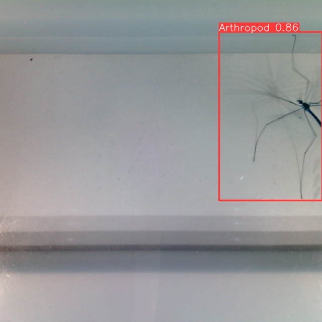

            |   | 
:-------------------------:|:-------------------------:|:-------------------------:

# Quick Arthropod Detector
Apply detection model to quickly detect any Arthropod on images

## Installation

#### Clone repository

```bash
git clone https://github.com/edgaremy/quick-detector.git
cd quick-detector
```

#### Option #1: Setup Python venv with Conda

- Make sure you first have Conda installed
- Create a new conda virtual env:
```bash
# You can replace "detector" by any name you like
conda create --name detector python=3.12.1
```
- You can now activate the venv, and install the requirements with pip:
```bash
pip install -r requirements.txt
```

The environment is now ready ! Note that you will need to activate the venv whenever you want to use it (and deactivate it when you're done):
```bash
# Activate the new venv:
conda activate detector

# Deactivate
conda deactivate
```

#### Option #2: Use already existing Python venv

Install requirements with pip:
```bash
pip install -r requirements.txt
```
#### Adding custom model

The model weights used are stored in the `/model` folder. We recommend adding any other custom weights here.

## Usage

Three script are currently available for direct use:
- `detect.py` for quickly detecting every arthropod on each frame in a folder.
- `track.py` which tries to detect arthropods by also keeping track of each individual while going through each frame (it's still a work in progress).
- `keep_useful_frames.py` applies the detection frame by frame in a folder. It then only copies in a new folder the frames, where something was actually detected.
